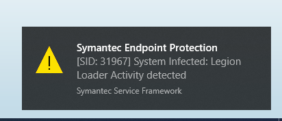
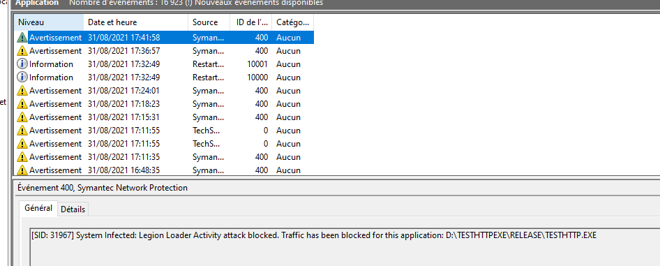

# Http Client
## Introduction

With Symantec activated we see the following error:  

## Pre-requisite
* Visual Studio 2019
* CMake 3+
* Node 12+

## Install
- open a console
  - run `cmake-2019-x64.bat` 
  - run `node server.js`
- open another console, 
- run `call "./Release/testhttp.exe"` 
=> you should see:  
`request failed, check windows event log, 12030` 

## Consult windows event log

